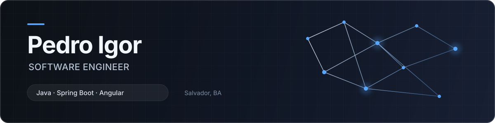

  

  Desenvolvo aplicações com foco em regras de negócio bem modeladas, integração entre serviços e código que outra pessoa consiga manter.

  
  

## Sobre mim

Sou desenvolvedor full stack em Salvador, Bahia. Hoje concentro meus estudos e projetos em Java com Spring Boot no backend e Angular com TypeScript no frontend.

Gosto da parte da engenharia que aparece além da tela: decisões arquiteturais, testes, segurança, observabilidade, automação de entrega e documentação que explica os motivos por trás do código. Nos projetos mais recentes, comecei a trabalhar com especificações antes da implementação e uso IA nas tarefas em que ela realmente poupa tempo. A decisão final continua sendo minha.

## Projetos em destaque

<table>
  <tr>
    <td width="33%" valign="top">
      <h3><a href="https://github.com/pedroigor-dev/projeto-lastro">Projeto Lastro</a></h3>
      
Hub de entrega orientada por especificação, com critérios de aceite, quality gates e apoio a processos de release.

      
<code>Java 21</code> <code>Spring Boot</code> <code>Angular</code> <code>MCP</code>

      <a href="https://github.com/pedroigor-dev/projeto-lastro#readme">Arquitetura e POC →</a>
    </td>
    <td width="33%" valign="top">
      <h3><a href="https://github.com/pedroigor-dev/sentinel-risk-service">Sentinel</a></h3>
      
Microsserviço antifraude explicável, preparado para processar eventos com idempotência e consistência transacional.

      
<code>Java 21</code> <code>Kafka</code> <code>PostgreSQL</code> <code>Outbox</code>

      <a href="https://github.com/pedroigor-dev/sentinel-risk-service#readme">Decisões técnicas →</a>
    </td>
    <td width="33%" valign="top">
      <h3><a href="https://github.com/pedroigor-dev/aurora-bank-cli">Aurora Bank</a></h3>
      
Aplicação bancária em linha de comando com arquitetura hexagonal, concorrência, investimentos e testes automatizados.

      
<code>Java 21</code> <code>Arquitetura hexagonal</code> <code>JUnit</code>

      <a href="https://github.com/pedroigor-dev/aurora-bank-cli#readme">Código e documentação →</a>
    </td>
  </tr>
</table>

## Tecnologias

  
  
  
  
  
  
  
  
  
  

## Como eu trabalho

- Especifico o comportamento e os critérios de aceite antes de implementar.
- Trato testes, análise estática e segurança como parte da entrega.
- Registro decisões e trade-offs para que o projeto continue compreensível depois do primeiro commit.
- Uso IA para acelerar pesquisa, revisão e tarefas repetitivas, sem terceirizar decisões técnicas.

## Outros trabalhos

Também mantenho projetos em C#/.NET, experiências visuais com TypeScript e estudos de arquitetura. O histórico completo está na aba [Repositórios](https://github.com/pedroigor-dev?tab=repositories).

  Meu foco atual: transformar requisito solto em decisão testável.

